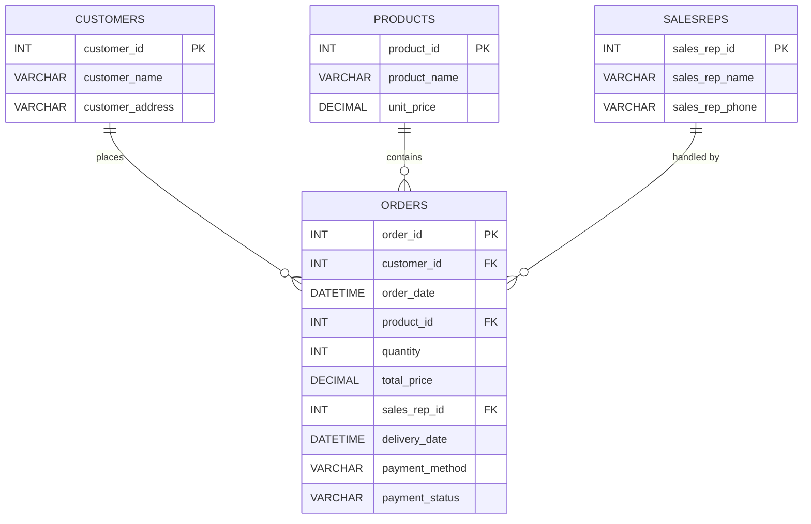

## 目标
- 试图搞清楚1NF、2NF、3NF的规范含义
- 试图找到一种范式与非范式之间的平衡应用与日常开发

## 题目
给定以下数据表，参考数据库设计范式进行结构优化，可以输出ER图或者表定义

### 表结构
```sql
CREATE TABLE Orders (
    order_id INT PRIMARY KEY,                    -- 订单ID
    customer_name VARCHAR(255),                  -- 客户名称
    customer_address VARCHAR(255),               -- 客户地址
    order_date DATETIME,                         -- 订单日期
    product_id INT,                              -- 产品ID
    product_name VARCHAR(255),                   -- 产品名称
    quantity INT,                                -- 数量
    unit_price DECIMAL(10, 2),                   -- 单价
    total_price DECIMAL(10, 2),                  -- 总价
    sales_rep_id INT,                            -- 销售代表ID
    sales_rep_name VARCHAR(255),                 -- 销售代表名称
    sales_rep_phone VARCHAR(20),                 -- 销售代表电话
    delivery_date DATETIME,                      -- 交货日期
    payment_method VARCHAR(50),                  -- 支付方式
    payment_status VARCHAR(50)                   -- 支付状态
);
```
### 表数据例子
| order_id | customer_name | customer_address  | order_date          | product_id | product_name | quantity | unit_price | total_price | sales_rep_id | sales_rep_name | sales_rep_phone | delivery_date       | payment_method | payment_status |
|----------|---------------|-------------------|---------------------|------------|--------------|----------|------------|-------------|--------------|----------------|-----------------|---------------------|----------------|----------------|
| 1        | A             | 华盛顿特区宾夕法尼亚大道1600号 | 2023-08-01 14:00:00 | 101        | 笔记本电脑        | 2        | 800.00     | 1600.00     | 1            | D              | 11111111        | 2023-08-05 09:00:00 | 信用卡            | 已支付            |
| 2        | B             | 唐宁街10号            | 2023-08-03 16:30:00 | 102        | 智能手机         | 1        | 600.00     | 600.00      | 2            | E              | 22222222        | 2023-08-07 10:00:00 | 支付宝            | 待支付            |
| 3        | A             | 华盛顿特区宾夕法尼亚大道1600号 | 2023-08-02 12:15:00 | 103        | 平板电脑         | 3        | 200.00     | 600.00      | 1            | D              | 11111111        | 2023-08-06 11:00:00 | 信用卡            | 已支付            |
| 4        | C             | 永田町2丁目3-1         | 2023-08-04 11:00:00 | 101        | 笔记本电脑        | 1        | 800.00     | 800.00      | 2            | E              | 22222222        | 2023-08-08 13:00:00 | 银行转账           | 已支付            |
| 5        | A             | 华盛顿特区宾夕法尼亚大道1600号 | 2023-08-05 14:30:00 | 104        | 显示器          | 2        | 150.00     | 300.00      | 1            | D              | 11111111        | 2023-08-09 09:30:00 | 信用卡            | 已支付            |


## 结果
### 三范式
1. 第一范式\
   1NF，是对属性的原子性约束，要求属性具有原子性，不可再分解。
2. 第二范式\
   2NF，是对记录的惟一性约束，要求记录有惟一标识，即实体的惟一性。
3. 第三范式\
   3NF，是对字段冗余性的约束，即任何字段不能由其他字段派生出来，它要求字段没有冗余。

### ER图



## 参考
- [https://xie.infoq.cn/article/e63302aa25e96b6985c295c9a?utm_campaign=geektime_search&utm_content=geektime_search&utm_medium=geektime_search&utm_source=geektime_search&utm_term=geektime_search](https://xie.infoq.cn/article/e63302aa25e96b6985c295c9a?utm_campaign=geektime_search&utm_content=geektime_search&utm_medium=geektime_search&utm_source=geektime_search&utm_term=geektime_search)
- [https://www.gatlin.io/content/database-normalization](https://www.gatlin.io/content/database-normalization)
- [https://dbgroup.cs.tsinghua.edu.cn/ligl/courses/slides03.pdf](https://dbgroup.cs.tsinghua.edu.cn/ligl/courses/slides03.pdf)
- [https://www.bilibili.com/video/BV15u4y1Q71R/?p=3&vd_source=2558b7e1b8fac6da441bcddd415cbd0d](https://www.bilibili.com/video/BV15u4y1Q71R/?p=3&vd_source=2558b7e1b8fac6da441bcddd415cbd0d)
- [https://highscalability.com/the-mother-of-all-database-normalization-debates-on-coding-h/](https://highscalability.com/the-mother-of-all-database-normalization-debates-on-coding-h/)
